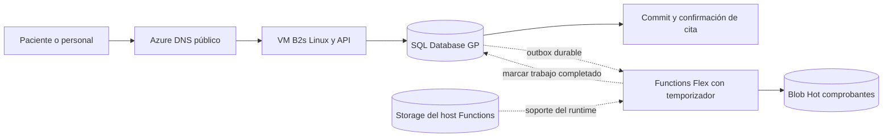
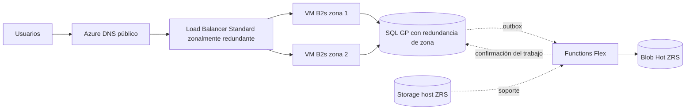

# Arquitectura P02. Agenda médica

## Flujo base

Líneas continuas: dependencias del paso correspondiente;
punteadas: trabajo desacoplado o soporte. El DNS resuelve el destino, no retransmite HTTP. VM y SQL están en serie para confirmar la cita. Functions y Blob no participan en la respuesta de reserva.

La API realiza la inserción de cita y outbox en la misma transacción SQL. Functions consulta trabajos pendientes cada minuto, adquiere una concesión transaccional y escribe un objeto con clave determinista por cita; marca terminado después de confirmar escritura. Un reintento no genera otra reserva. No se agrega una cola externa: la outbox está en SQL. El temporizador y el runtime necesitan una cuenta Storage del host, incluida en presupuesto y explícita en el flujo.

## Escenario redundante

Las VM están en paralelo entre sí, con discos Premium independientes, sin estado de sesión local obligatorio y con restricción de unicidad en SQL. El balanceador, la capa VM y SQL siguen en serie. Se selecciona IP frontend Standard redundante entre zonas; dos IP Standard de salida de las VM permiten actualizaciones y conexión a servicios sin depender de salida implícita.

Región propuesta: East US. La calculadora permitió seleccionar SQL GP con redundancia de zona; las fuentes de confiabilidad documentan soporte de zonas para los servicios considerados. Una tarifa de catálogo no acredita cuota ni capacidad de una suscripción concreta: deberán comprobarse al desplegar. Functions permanece Flex on-demand; no se atribuye una mejora de SLA ni se afirma zona redundante del cómputo Functions. Su host Storage sí pasa de LRS a ZRS.

DNS se incluye como dependencia auxiliar con compromiso 100 % bajo condiciones contractuales; Load Balancer se incluye solo en el modelo redundante con 99.99 %. Esto no implica que nunca fallen. VNet y las IP son parte del camino de conectividad cubierto por las cláusulas respectivas; no se les asigna un SLA independiente inventado.

El componente Storage del flujo asíncrono agrupa host y comprobantes en el SLA de Storage de la suscripción. El producto es una aproximación pedagógica que no representa una distribución empírica de fallas; host y Blob pueden compartir fallas y no se multiplican como si fueran independientes. El tiempo de espera y los reintentos de outbox no se deducen de ese producto.

No se incluyen pasarela de pagos, correo, expediente clínico, videollamada ni diagnóstico. DNS público presupone un subdominio delegado sin costo adicional por la institución/equipo; si hay que comprar dominio, se cotiza por separado. TLS se termina en el proxy de cada VM con certificado renovable sin costo. Monitorización y errores de aplicación quedan bajo responsabilidad del equipo.

El objetivo de residencia exclusiva en México pertenece únicamente a la pregunta de análisis 3: la arquitectura principal en East US no lo cumple ni lo pretende.
